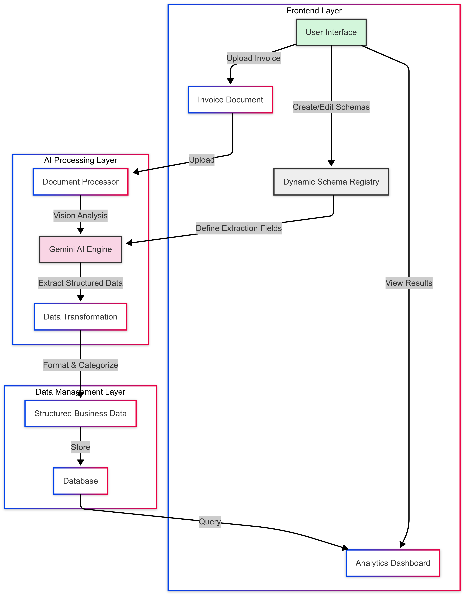

# Invoice Intelligence: AI-Powered Document Extraction

An advanced document processing application that leverages Google's Gemini AI model to extract structured data from invoices and other business documents with unprecedented accuracy and flexibility.


## Demo

Watch how easy it is to extract data from your invoices:


## Key Features

- **Multimodal AI Processing**: Extract data from PDFs or images using Google's Gemini AI
- **Advanced Hierarchical Schema System**: Define complex data structures with parent-child relationships
- **Intelligent Data Categorization**: Automatically organize extracted information into business categories
- **Context-Aware Formatting**: Special handling for addresses, line items, and complex data types
- **JSON-Based Schema Editor**: Developer-friendly interface for creating extraction templates
- **Visual Schema Preview**: See live previews of schema structure and example outputs
- **Extraction History**: Review and compare previous extraction results
- **Modern, Responsive UI**: Clean interface with professional styling and intuitive workflows
- **SQLite Database**: Store extraction schemas and results for future reference

## Business Benefits

- **Reduce Manual Data Entry**: Cut processing time by up to 85%
- **Minimize Errors**: Eliminate typos and transcription mistakes
- **Increase Consistency**: Standardize data formats across all documents
- **Improve Searchability**: Make document content fully searchable and analyzable
- **Enable Automation**: Feed extracted data into workflows and business systems
- **Adapt to New Formats**: Create custom schemas for different document types

## Screenshots

*Add screenshots of your application here*

## Getting Started

### Prerequisites

- Python 3.8 or later
- Google Cloud account with Vertex AI access
- Service account credentials with Vertex AI permissions

### Installation

1. Clone the repository:

```bash
git clone https://github.com/yourusername/invoice-intelligence.git
cd invoice-intelligence
```

2. Create and activate a virtual environment:

```bash
python -m venv venv
source venv/bin/activate  # On Windows: venv\Scripts\activate
```

3. Install dependencies:

```bash
pip install -r requirements.txt
```

4. Set up environment variables by creating a `.env` file:

```
# Google Cloud / Vertex AI
VERTEX_AI_PROJECT_ID=your-project-id
VERTEX_AI_LOCATION=us-central1  # or your preferred region
GOOGLE_APPLICATION_CREDENTIALS=/path/to/service-account.json

# App settings (optional)
DEBUG=False
```

5. Create necessary directories:

```bash
mkdir -p data uploads outputs
```

## Usage

1. Start the application:

```bash
python -m ocr_app.run_streamlit
```

2. Access the application in your browser at http://localhost:8501

3. Navigate through the three main tabs:
   - **Document Extraction**: Upload and process invoices
   - **Schema Editor**: Create and customize extraction schemas
   - **Extraction History**: Review previous extraction results

## Creating Custom Schemas

The Schema Editor offers two complementary approaches:

### 1. Advanced JSON Schema Definition

Create complex hierarchical schemas with parent-child relationships:

```json
[
  {
    "name": "Invoice Details",
    "description": "Basic invoice information",
    "type": "object",
    "required": true,
    "parent": null,
    "children": [
      {
        "name": "Invoice Number",
        "description": "Unique identifier",
        "type": "string",
        "required": true,
        "parent": "Invoice Details"
      }
    ]
  }
]
```

### 2. Visual Schema Builder

Use the visual editor to:
- Create fields and containers
- Organize hierarchical relationships
- Set field properties and requirements
- Preview the schema structure

## Extract and View Documents

1. Upload a PDF invoice
2. Select an extraction schema
3. View the extraction results organized by:
   - Invoice Information
   - Vendor Details
   - Customer Information
   - Line Items
   - Payment Details
4. Access the raw JSON data through the expandable section

## Technical Architecture



## Technical Details

- **Gemini AI**: Leverages Google's multimodal AI for document understanding
- **Streamlit Framework**: Provides the responsive web interface
- **SQLite Database**: Stores extraction schemas and results locally
- **Async Processing**: Handles document processing asynchronously for better performance
- **Error Handling**: Comprehensive validation and error reporting

## Folder Structure

```
ocr_app/
├── app.py              # Main Streamlit application
├── static/
│   └── css/            # Custom styling
├── data/               # SQLite database and application data
├── models/             # AI model implementations
├── schemas/            # Data schema definitions
├── db/                 # Database operations
├── utils/              # Helper functions and utilities
├── sample_invoices/    # Sample documents for testing
├── uploads/            # Temporary storage for uploaded files
└── README.md           # This documentation
```

## Future Roadmap

- **Batch Processing**: Handle multiple documents simultaneously
- **API Integration**: Connect with accounting systems via API
- **Custom Training**: Allow schema-specific model fine-tuning
- **Advanced Analytics**: Visualization and reporting on extracted data
- **Vendor Recognition**: Automatic schema selection based on vendor detection

## Contributing

Contributions are welcome! Please feel free to submit a Pull Request.

1. Fork the repository
2. Create your feature branch (`git checkout -b feature/amazing-feature`)
3. Commit your changes (`git commit -m 'Add some amazing feature'`)
4. Push to the branch (`git push origin feature/amazing-feature`)
5. Open a Pull Request


## Acknowledgments

- Google Vertex AI and Gemini model
- Streamlit for the interactive web framework
- The open-source community for invaluable libraries and tools 